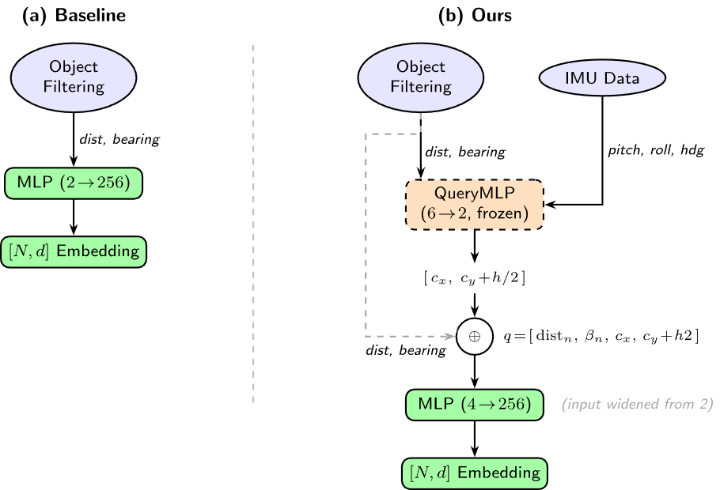
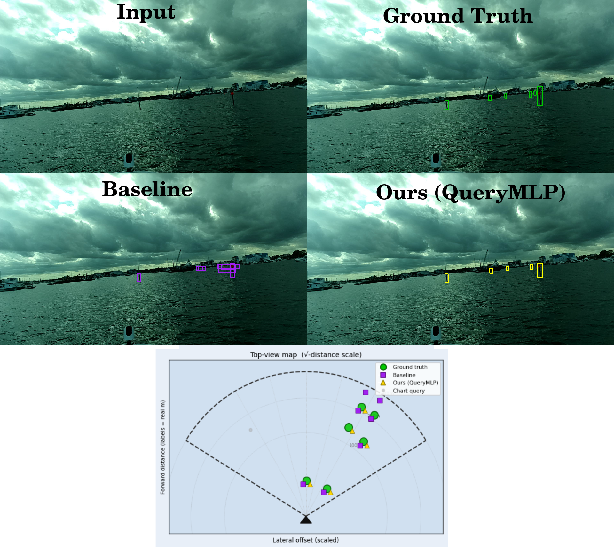

# Vision-to-Chart Buoy Association with Learned World-to-Image Projection — 2nd Place Solution

This repository extends the [MaCVi @ CVPR 2026 Vision-to-Chart baseline](https://github.com/mkaraaslan-dev/CVPR2026-Transformer) with a learned world-to-image projection (QueryMLP) that achieves **Overall = 0.7386** (F1 = 0.8055, mIoU = 0.6718) on the held-out test set, placing **2nd** on the challenge leaderboard.

> **Paper:** *Improved Vision-to-Chart Buoy Association with Learned World-to-Image Projection* — [arXiv link TBD]  
> **Challenge:** https://macvi.org/workshop/cvpr/challenges/vision_map  
> **Author:** Borja Carrillo-Perez (Arquimea Research Center)

---

## Method overview

The baseline DETR decoder receives per-buoy queries encoding only world-space distance and bearing, forcing the transformer to learn the full geometric projection implicitly. This solution adds a small frozen MLP (**QueryMLP**) trained to explicitly predict the buoy's waterline contact point in the image from chart measurements and IMU orientation. The predicted pixel coordinates are appended to each query vector, giving the decoder a direct spatial prior and reducing what it must learn from scratch.



At inference a logit bias of **−0.5** is applied before thresholding (calibrated on the validation set via `sweep_bias_mlp.py`).

---

## Results

| Model (split) | P | R | F1 | mIoU | Overall |
|---|---|---|---|---|---|
| Baseline (val) | 0.7970 | 0.7912 | 0.7941 | 0.6445 | 0.7193 |
| Ours (val) | 0.8627 | 0.7761 | 0.8171 | 0.6753 | **0.7462** |
| Ours (test, leaderboard 2nd place) | 0.8563 | 0.7604 | 0.8055 | 0.6718 | **0.7386** |

The baseline is trained under identical conditions (same COCO init, hyperparameters, augmentations, epochs) but uses only the original 2D query (distance + bearing), without IMU input or pixel coordinate prediction.



---

## Repository structure

```
macvi26-visionmap-querymlp/
├── query_mlp.py                  ← QueryMLP architecture
├── query_mlp.pth                 ← frozen QueryMLP weights (committed)
├── train_query_mlp.py            ← Step 1: train the frozen MLP
├── training.py                   ← Step 2: fine-tune DETR with 4D queries
├── sweep_bias_mlp.py             ← Step 3: find optimal logit bias on val set
├── evaluate.py                   ← Step 4: run evaluation (submit this)
├── training_baseline.py          ← train the 2D-query baseline for comparison
├── sweep_bias_baseline.py        ← find optimal logit bias for baseline
├── evaluate_baseline.py          ← evaluate the baseline model
├── assets/
│   ├── diagram.png               ← architecture diagram
│   └── comparison_00079.png      ← qualitative comparison figure
├── datasets/
│   ├── buoy_dataset.py           ← modified: integrates frozen QueryMLP
│   └── buoy_dataset_baseline.py  ← original dataset (no QueryMLP)
├── models/                       ← unchanged from baseline
├── util/                         ← unchanged from baseline
├── dataset.yaml                  ← set your dataset paths here
└── Dockerfile                    ← reproducible evaluation environment
```

**Pre-trained weights:**
- `query_mlp.pth` — frozen QueryMLP weights (148 KB, committed to this repo)
- `checkpoints/best.pth` — fine-tuned DETR weights (475 MB) — download from [GitHub Releases](https://github.com/bcarrpe/macvi26-visionmap-querymlp/releases/tag/v1.0)
- `detr-r50-e632da11.pth` — COCO-pretrained DETR-R50 init weights ([download](https://dl.fbaipublicfiles.com/detr/detr-r50-e632da11.pth))

---

## Quickstart (Docker)

### 1. Download weights

```bash
# DETR weights (place in repo root)
wget https://dl.fbaipublicfiles.com/detr/detr-r50-e632da11.pth

# Submission weights (place in checkpoints/)
mkdir -p checkpoints
# Download checkpoints/best.pth from GitHub Releases (see link above)
```

`query_mlp.pth` is already in the repo — no download needed.

### 2. Build the image

```bash
docker build -t buoy-eval .
```

### 3. Run evaluation

```bash
docker run --gpus all \
    -v $(pwd):/workspace \
    -v /path/to/aton-dataset:/dataset \
    -it buoy-eval bash -c "cd /workspace && mkdir -p test_results && python evaluate.py"
```

Replace `/path/to/aton-dataset` with the local path to the ATON dataset (request access via the [challenge page](https://macvi.org/workshop/cvpr/challenges/vision_map))

Results are printed to stdout and saved to `results.json` and `test_results/np_arr.npy`.

---

## Full training pipeline

All steps below assume you are inside the Docker container (`cd /workspace`).

### Step 1 — Train QueryMLP

```bash
python train_query_mlp.py
```

Outputs `query_mlp.pth`. Trains up to 1000 epochs with early stopping (patience = 60); converges around epoch 585. Expected validation pixel error: median ≈ 18 px.

### Step 2 — Download COCO-pretrained DETR-R50 weights

```bash
wget https://dl.fbaipublicfiles.com/detr/detr-r50-e632da11.pth
```

### Step 3 — Fine-tune DETR

```bash
python training.py
```

Fine-tunes up to 200 epochs (StepLR drop at epoch 135). Best checkpoint saved to `checkpoints/best.pth` (expected around epoch 182).

### Step 4 — Calibrate logit bias

```bash
python sweep_bias_mlp.py
```

Sweeps bias values over [−3, 3] on the validation set. Expected optimal bias: **−0.5**.

### Step 5 — Evaluate

```bash
mkdir -p test_results
python evaluate.py
```

---

## Requirements

- Docker with NVIDIA GPU support (`nvidia-container-toolkit`)
- NVIDIA GPU, CUDA 12.1+, ≥ 8 GB VRAM
- Dataset: ATON dataset (request access via the [challenge page](https://macvi.org/workshop/cvpr/challenges/vision_map))

---

## Citation

If you use this work please cite:

```bibtex
@article{carrilloperez2025v2c,
  author  = {Carrillo-Perez, Borja},
  title   = {Improved Vision-to-Chart Buoy Association with Learned World-to-Image Projection},
  year    = {2025},
  note    = {arXiv link TBD}
}
```

And the challenge baseline:

```bibtex
@misc{kreis2025realtime,
  author       = {Kreis, M. and Kiefer, B.},
  title        = {Real-Time Fusion of Visual and Chart Data for Enhanced Maritime Vision},
  year         = {2025},
  eprint       = {2507.13880},
  archivePrefix= {arXiv}
}
```
